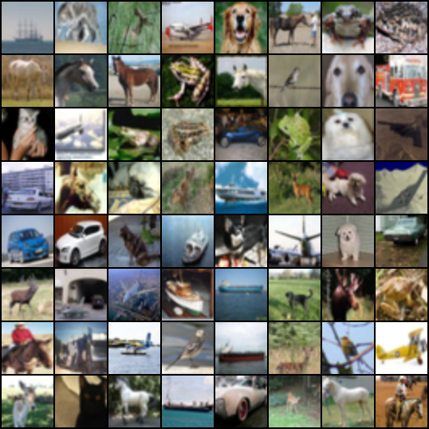
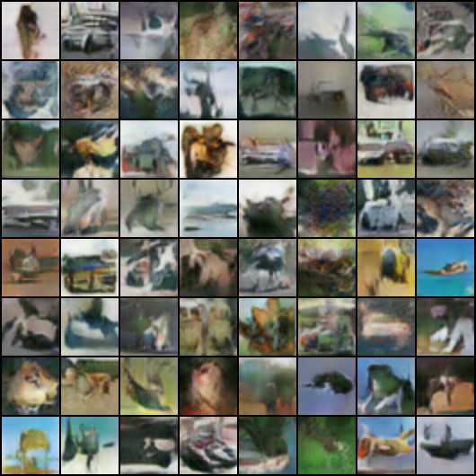

# 🎨 DCGAN from Scratch — PyTorch

A clean, from-scratch implementation of Deep Convolutional Generative Adversarial Networks (DCGAN) in modern PyTorch, trained on CIFAR-10.

## What It Does

Trains a GAN to generate realistic images from random noise using the [DCGAN architecture](https://arxiv.org/abs/1511.06434) (Radford et al., 2015). A **Generator** creates fake images from a latent vector, while a **Discriminator** learns to distinguish real from fake. They train adversarially until the generator produces convincing outputs.

```
Random Noise (z=100) → [Generator] → Fake Image (3×64×64)
                                           ↓
Real Image (CIFAR-10) → [Discriminator] → Real or Fake?
```

## Architecture

| Component     | Details                                              |
|---------------|------------------------------------------------------|
| Generator     | 5 transposed conv layers, BatchNorm, ReLU, Tanh out  |
| Discriminator | 5 conv layers, BatchNorm, LeakyReLU (0.2), Sigmoid   |
| Latent dim    | 100                                                  |
| Image size    | 64×64×3                                              |
| Optimizer     | Adam (lr=0.0002, β₁=0.5, β₂=0.999)                 |
| Loss          | Binary Cross-Entropy (BCELoss)                       |
| Epochs        | 25                                                   |

## Dependencies

```bash
pip install torch torchvision
```

- Python 3.7+
- PyTorch ≥ 1.0
- torchvision

## How to Run

```bash
cd GANs
mkdir -p results
python dcgan_commented.py
```

CIFAR-10 downloads automatically on first run. Generated samples save to `GANs/results/` every 100 steps.

## Results

**Real samples** (CIFAR-10):



**Generated samples** (epoch 24):



## 🛠 Tech Stack

| Tool | Purpose |
|------|---------|
| 🐍 Python | Core language |
| 🔥 PyTorch | Deep learning framework |
| 🖼 torchvision | Dataset loading, image transforms, utilities |
| 🧠 DCGAN | Generative adversarial network architecture |
| 📊 CIFAR-10 | Training dataset (60k 32×32 color images) |

## ⚠️ Known Issues

- No GPU/CUDA device selection — runs on CPU only. For GPU support, move tensors and models to `device = torch.device("cuda" if torch.cuda.is_available() else "cpu")`.
- Training for only 25 epochs produces rough outputs. Increase epochs for better quality.
- No checkpointing — training restarts from scratch each run.
- No command-line arguments for hyperparameter tuning.

## Project Structure

```
├── GANs/
│   ├── dcgan_commented.py    # Full DCGAN implementation
│   └── results/              # Generated image samples per epoch
├── LICENSE
└── README.md
```

## License

MIT © [Kaustabh Ganguly](https://github.com/stabgan)
